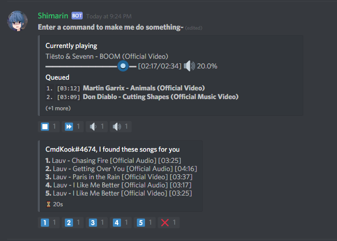

# Shimarin

Shimarin is a (WIP) Self-Hosted Discord Music Bot written in Typescript.  
Most of the inspiration came from [jagrosh's music bot](https://github.com/jagrosh/MusicBot).  

This bot was made with the intent of learning Typescript. The code might be bad in places (or not follow conventions).  

I'll be working on improving this somewhat.

## Features

- Cleans up user commands
- Only uses 1 message which is updated in favor of creating a new one every time a command is issued (which would clutter the chat log).
- Moves its 1 message to the bottom of the chat log (waits if people are chatting)
- Support for Youtube song urls
- Searching for youtube songs by keyword
- Reaction based bot interaction system. The amount of commands you need to use is minimal
- Shows song progression

## Setup

Go [here](./md/setup-guide.md) for a setup guide

## Example

## Commands
[Commands](./md/commands.md)

## Planned Features/Improvements

Can be found [here](./md/planned.md) 
